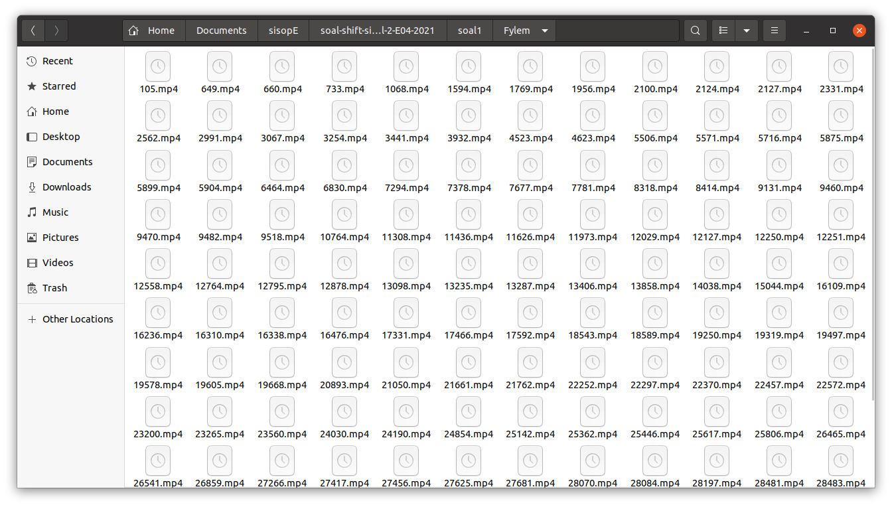

# soal-shift-sisop-modul-2-E04-2021
### Anggota:
1. [Frans Wijaya](https://github.com/franswjy403)	(05111940000098)
2. [Jagad Wijaya P.](https://github.com/Jagadwp)	(05111940000132)
3. [Fidhia Ainun K.](https://github.com/fidhiaaka)	(05111940000203)

### List soal:
1. [Soal 1](#soal1)
2. [Soal 2](#soal2)
3. [Soal 3](#soal3)

## Soal 1
Pada soal ini, Steven ingin memberikan hadiah kepada Stevany. Steven ingin memberikan Stevany zip berisikan hal-hal yang disukai Stevany. Steven ingin isi zipnya menjadi rapi dengan membuat folder masing-masing sesuai extensi. Untuk menyiapkan hadiah tersebut, Steven membutuhkan sebuah program yang dapat:
1. (a) Dikarenakan Stevany sangat menyukai huruf Y, Steven ingin nama folder-foldernya adalah Musyik untuk mp3, Fylm untuk mp4, dan Pyoto untuk jpg.
2. (b) Untuk musik, film, dan foto Steven mendownloadnya dari link yang telah disediakan. 
3. (c) Steven tidak ingin isi folder yang dibuatnya berisikan zip, sehingga perlu meng-extract-nya setelah didownload
4. (d) Memindahkannya ke dalam folder yang telah dibuat (hanya file yang dimasukkan).
5. (e) Untuk memudahkan Steven, ia ingin semua hal di atas berjalan otomatis 6 jam sebelum waktu ulang tahun Stevany. 
6. (f) Setelah itu pada waktu ulang tahunnya Stevany, semua folder akan di zip dengan nama Lopyu_Stevany.zip dan semua folder akan di delete(sehingga hanya menyisakan .zip).

Agar program ini dapat berjalan secara otomatis ketika 6 jam sebelum ulang tahun Stevany dan juga tepat ketika ulang tahun Stevany, maka program yang dibuat akan menghasilkan daemon process.

## Jawaban Soal 1a
Untuk membuat folder, digunakan sebuah **fork** untuk membuat child process yang akan membuat folder. Sehingga, total ada 3 fork yang dipanggil. Dimana, masing-masing fork akan mengeksekusi perintah mkdir.
```c
cid1 = fork();
        if (cid1 < 0)exit(0);
        if (cid1 == 0){
            char *ag[] = {"mkdir", "-p", "Musyik", NULL};
            execv("/bin/mkdir", ag);
        }
        
        cid2 = fork();
        if (cid2 < 0)exit(0);
        if (cid2 == 0){
            char *ag[] = {"mkdir", "-p", "Fylem", NULL};
            execv("/bin/mkdir", ag);
        }

        cid3 = fork();
        if (cid3 < 0)exit(0);
        if (cid3 == 0){
            char *ag[] = {"mkdir", "-p", "Pyoto", NULL};
            execv("/bin/mkdir", ag);
        }
```
Untuk pembuatan folder, tidak diperlukan wait. Karena tidak akan terjadi masalah apabila sebuah folder dibuat baik setelah atau sebelum folder sebelumnya terbuat.
## Jawaban soal 1b, 1c, dan 1d
Untuk setiap link download, dipanggil fungsi fork masing-masing untuk mendownload dari link yang ada (1b). Dalam eksekusi command wget, disertakan opsi -O untuk merename file yang di download, serta -o untuk mengambil log download. Tetapi log download ini akan dibuang ke /dev/null/.
```c
while(wait(&status2)>0);
        cid5 = fork();
        if (cid5 < 0) exit(0);
        if (cid5 == 0){
            char *ag[] = {"wget", "--no-check-certificate", "https://drive.google.com/uc?id=1ktjGgDkL0nNpY-vT7rT7O6ZI47Ke9xcp&export=download", "-O", "Fylem_for_stevany.zip", "-o", "/dev/null", NULL};
            execv("/bin/wget", ag);
        }
```
Setelah itu, dibuat lagi sebuah child proccess untuk mengekstrak file dalam zip yang terdownload (1c). 
```c
while(wait(&status6)>0);
        cid8 = fork();
        if (cid8 < 0) exit (0);
        if (cid8 == 0){
            char *ag[] = {"unzip", "Fylem_for_stevany.zip", "-d", "/home/frans0416/Documents/sisopE/soal-shift-sisop-modul-2-E04-2021/soal1", NULL};
            execv("/bin/unzip", ag);
        }
```
Kemudian, dilakukan iterasi file pada masing-masing folder (MUSIK, FILM, FOTO). Setiap file akan dipindahkan ke folder yang bersesuaian (file dalam MUSIK dipindah ke Musyik, dan seterusnya) dengan memanggil sebuah child proccess yang mengeksekusi command **move (mv)**. Setelah semua file dipindahkan, dibuat lagi sebuah child proccess untuk menghapus folder lama (MUSIK, FILM, FOTO).
```c
while(wait(&statB)>0);
        char pathFilm[] = "/home/frans0416/Documents/sisopE/soal-shift-sisop-modul-2-E04-2021/soal1/FILM";
        dp = opendir(pathFilm);
        if (dp != NULL)
        {
                int statTemp;
                char dest[500]="/home/frans0416/Documents/sisopE/soal-shift-sisop-modul-2-E04-2021/soal1/Fylem";
                while ((ep = readdir (dp))) {
                        char src[500];
                        sprintf(src, "%s/%s", pathFilm, ep->d_name);
                        cid10 = fork();
                        if (cid10 < 0) exit(0);
                        if (cid10 == 0){
                            char *ag[] = {"mv", "-t", dest, src, NULL};
                            execv("/bin/mv", ag);
                        }
                    }
                (void) closedir (dp);
                while(wait(&statTemp)>0);
                cidT2 = fork();
                if (cidT2 < 0)exit(0);
                if (cidT2 == 0){
                    char *ag[]={"rm", "-r", "FILM", NULL};
                    execv ("/bin/rm", ag);
                }
            } else perror ("Couldn't open the directory"); 
```

Untuk setiap selesai pemanggilan sebuah fork(), dijalankan perintah wait (terkecuali untuk proses pemindahan) agar proses bisa berjalan secara urut. Berikut adalah code serangkaian proses di atas, untuk folder Film.

Untuk pemindahan file dari folder MUSIK dan FOTO ke Musyik dan Pyoto, menggunakan alur serupa.

Berikut adalah hasil keseluruhan soal 1a sampai 1d:

Berikut adalah isi dari zip yang didownload

Berikut adalah isi dari folder Fylem setelah diisi file-file dari folder Film

## Jawaban soal 1e
Agar program berjalan sesuai waktu yang diminta, maka selama proses daemon berjalan, akan dicek, apakah waktunya adalah 9 April 16:22:00 (6 jam sebelum ulang tahun stevany). Jika iya, maka proses-proses yang telah dijelaskan di atas akan dijalankan. Adapun pengondisian waktu didetailkan hingga detiknya agar daemon menjalankan perintah-perintahnya sekali saja.
```c
time_t times = time(NULL);
struct tm* date = localtime(&times);
char birthday[40];
strftime(birthday, 30, "%m-%d_%H:%M:%S", date);
```
Rangkaian syntax di atas berfungsi untuk mengambil waktu saat ini, kemudian dituliskan ulang dalam format bulan-hari_jam-menit-detik. Pengondisiannya diberikan sebagai berikut `if (strcmp(birthday, "04-09_16:22:00")==0)`.
## Jawaban Soal 1f
Untuk menzip ketiga folder tersebut, dipanggil sebuah child proccess untuk mengeksekusi perintah zip. 
```c
while (wait(&statD)>0);
            cidT4 = fork();
            if (cidT4 < 0)exit(0);
            if (cidT4 == 0){
                char *ag[] = {"zip", "-r", "Lopyu_Stevany.zip", "Musyik", "Fylem", "Pyoto", NULL};
                execv("/bin/zip", ag);
            }
```
Setelah itu, dipanggil juga sebuah child proccess untuk menghapus ketiga folder lama sekaligus.
```c
while (wait(&statE)>0);
            cidT5 = fork();
            if (cidT5 < 0)exit(0);
            if (cidT5 == 0){
                char *ag[] = {"rm", "-rf", "Musyik", "Fylem", "Pyoto", NULL};
                execv("/bin/rm", ag);
            }
```
Pengondisian waktu agar kedua rangkaian perintah di atas dijalankan tepat saat ulang tahun Stevany (9 April 22:22:00) adalah sebagai berikut `if (strcmp(birthday, "04-09_22:22:00")==0)`.

Berikut adalah hasil dari soal1e dan 1f.

Berikut adalah isi dari zip lopyu

## Soal 2
Pada soal ini, diminta sebuah program yang dapat membantu Loba untuk menjalankan tugas-tugas sebagai berikut:
1. (a) Mengekstrak zip petshop kemudian menghapus folder-folder tidak diperlukan
2. (b) Mengkategorikan foto-foto yang ada ke dalam direktori khusus. Misal jenis peliharan kucing akan disimpan ke dalam direktori **cat**. Secara tidak langsung, meminta program membuat folder untuk setiap jenis hewan yang terdeteksi dalam zip petshop.
3. (c) Memindahkan foto-foto yang ada ke dalam folder yang bersesuaian, kemudian direname dengan nama hewan tersebut.
4. (d) Jika terdapat 2 hewan dalam satu foto, maka foto tersebut harus masuk ke dalam dua kategori, dimana dalam setiap kategorinya, nama file disesuaikan dengan nama hewan yang bersesuaian. (Misal, cat;ava;6_dog:walter;7 -> maka harus masuk ke folder cat dengan nama ava.jpg dan masuk ke folder dog dengan nama walter.jpg)
5. (e) Membuat sebuah file **keterangan.txt** untuk menyimpan list nama hewan dan umur yang ada di folder tersebut.

## Jawaban soal 2a
Untuk mengekstrak file zip, dilakukan dengan memanggil sebuah child proccess yang mengeksekusi perintah unzip.
```c
cid1 = fork();
    if (cid1 < 0) exit(0);
    if (cid1 == 0){
        char *ag[] = {"unzip", "pets.zip", "-d", "/home/frans0416/modul2/petshop", NULL};
        execv("/bin/unzip", ag);
    }
```
Kemudian, untuk menghapus folder-folder tidak digunakan, dilakukan iterasi tiap file dan folder yang ada pada direktori petshop. Iterasi ini memanfaatkan fungsi opendir dan readdir dari library `dirent.h`.
```c
while(wait(&stat1)>0);
    char path[] = "/home/frans0416/modul2/petshop";
    dp = opendir(path);
    if (dp != NULL)
    {
        while ((ep = readdir (dp))) {
            char pathTemp[500];
            sprintf(pathTemp,"%s/%s", path, ep->d_name);
            if ((strcmp(ep->d_name, ".")==0) || (strcmp(ep->d_name, "..")==0))continue;
            if (!is_regular_file(pathTemp)){
                cid2 = fork();
                if (cid2 < 0)exit(0);
                if (cid2 == 0){
                    char *ag[] = {"rm", "-r", pathTemp, NULL};
                    execv("/bin/rm", ag);
                }
            }
        }
        (void) closedir (dp);
    } else perror ("Couldn't open the directory");
```
Terdapat kondisi pengecualian `if ((strcmp(ep->d_name, ".")==0) || (strcmp(ep->d_name, "..")==0))continue;` yang berfungsi untuk mengskip direktori saat ini dan direktori parent.

Kemudian, untuk setiap direktori dan file selain `.` dan `..` dilakukan pengecekan, apakah file tersebut merupakan direktori atau bukan menggunakan fungsi `is_regular_file` sebagai berikut. Fungsi ini akan mengembalikan nilai FALSE jika file yang ditunjuk merupakan direktori.
```c
int is_regular_file(const char *path)
{
    struct stat path_stat;
    stat(path, &path_stat);
    return S_ISREG(path_stat.st_mode);
}
```
Jika terdeteksi sebuah file adalah direktori, maka hapus.
## Jawaban Soal 2b
Untuk mengkategorikan foto-foto, maka tentunya harus dibuat terlebih dahulu folder-folder hewannya. Untuk membuat folder-folder hewan, maka diperlukan unique animal names agar folder yang dibuat tidak redundan. Untuk melakukan rangkaian tersebut, berikut langkah-langkah yang dilakukan:

1. Nama-nama file berekstensi .jpg, nama filenya saja, dimasukkan ke dalam array dua dimensi `files`.
```C
while(wait(&stat2)>0);
    dp = opendir(path);
    if (dp != NULL)
    {
        while ((ep = readdir (dp))) {
            if ((strcmp(ep->d_name, ".")==0) || (strcmp(ep->d_name, "..")==0))continue;
            char fileName[500];
            sprintf(fileName, "%s", ep->d_name);
            insertFiles(fileName);
        }
        (void) closedir (dp);
    } else perror ("Couldn't open the directory");
```
Proses pemasukan nama file ini memanfaatkan fungsi insertFiles sebagai berikut:
```c
void insertFiles(char fileName[]){
    int i;
    char temp[100]="";
    for (i=0;i<strlen(fileName);i++){
        if(fileName[i]=='.' && fileName[i+1]=='j'){
            strcpy(files[countFiles++], temp);
            strcpy(temp, "");
            break;
        }
        if(fileName[i]=='_'){
            strcpy(files[countFiles++], temp);
            strcpy(temp, "");
            continue;
        }
        strncat(temp, &fileName[i], 1);
    }
}
```
Fungsi insert files ini fungsi utamanya untuk mendapatkan 1 paket nama file, kemudian dimasukkan ke array files. Misalkan **cat;ava;6_dog;walter;7.jpg**, maka dengan fungsi insert files, akan ada dua string yang dimasukkan ke dalam array files, yaitu **cat;ava;6** dan **dog;walter;7**.
2. Setelah didapan jenis, nama, dan umur hewan dalam satu paket, selanjutnya, satu paket string ini akan diubah menjadi sebuah tipe data struct `anmls` yang secara terpisah menyimpan jenis, nama, dan umur.
```c
for (i = 0; i < countFiles; i++)
    {
        animal[countAnimals]=substr(files[i], ';');
        countAnimals++;
    }
```
Fungsi substr berperan penting dalam memecah string hewan ke dalam struct. Berikut isi fungsinya:
```c
anmls substr(char string[], char delim){

    anmls hewan;
    int i;
    char temp[100]="";
    for (i=0;i<strlen(string);i++){
        if (string[i]==delim)break;
        strncat(temp, &string[i], 1);
    }
    strcpy(hewan.jenis, temp);
    ++i;

    char temp2[100]="";
    for (;i<strlen(string);i++){
        if (string[i]==delim)break;
        strncat(temp2, &string[i], 1);
    }
    strcpy(hewan.nama, temp2);
    ++i;

    char temp3[100]="";
    for (;i<strlen(string);i++){
        strncat(temp3, &string[i], 1);
    }
    strcpy(hewan.umur, temp3);

    return hewan;
}
```
3. Kumpulan struct anmls tadi disimpan dalam array animals. Kemudian, dilakukan iterasi pada array animals, untuk mencari jenis-jenis hewan yang ada.
```c
for (i = 0;i<countAnimals;i++){
        if(countUniqueAnimals==0 || !checkAnimal(animal[i].jenis, countUniqueAnimals)){
            strcpy(uniqueAnimals[countUniqueAnimals++], animal[i].jenis);
        }
    }
```
Proses ini memanfaatkan fungsi checkAnimal untuk mencari tahu, apakah jenis hewan tertentu, sudah tercatat dalam unique animals array atau belum. Berikut fungsi checknya:
```c
int checkAnimal(char jenisAnimal[], int count){
    int i;
    for (i=0; i < count ; i++){
        if (strcmp(jenisAnimal, uniqueAnimals[i])==0) return 1;
    }
    return 0;
}
```
Dari proses ini, didapatkan 15 jenis hewan.
4. Proses terakhir, dari 15 jenis hewan tersebut dibuatlah folder masing-masing.
```c
for (i=0;i<countUniqueAnimals;i++){
        cid3 = fork();
        if (cid3 < 0)exit(0);
        if (cid3 == 0){
            char filePath[500];
            sprintf(filePath, "%s/%s", path, uniqueAnimals[i]);
            char *ag[] = {"mkdir", "-p", filePath, NULL};
            execv("/bin/mkdir", ag);
        }
    }
```
## Jawaban Soal 2c dan 2d
Untuk memindahkan foto-foto yang ada di petshop ke dalam plottingan folder masing-masing, proses yang dilakukan adalah sebagai berikut:
1. Mengcopy file yang ada di petshop ke folder yang bersesuaian. Cara memplottingnya adalah, nama file yang sekarang sedang ditunjuk, dicek satu satu dengan nama hewan unik yang terdaftar. Pengecekan ini menggunakan fungsi strstr untuk mencari substring. Setelah didapatkan plottingannya, file langsung di copy ke folder yang sesuai, dengan format nama hewan yang sesuai pula. Untuk mengekstrak nama hewan sesuai dengan jenisnya, digunakan fungsi makeFileName.
```c
while(wait(&stat3)>0);
    dp = opendir(path);
    if (dp != NULL)
    {
        int j;
        while ((ep = readdir (dp))) {
            if ((strcmp(ep->d_name, ".")==0) || (strcmp(ep->d_name, "..")==0))continue;
            char fileName[500];
            sprintf(fileName, "%s", ep->d_name);
            for (j=0; j<countUniqueAnimals;j++){
                char* flag = strstr(fileName, uniqueAnimals[j]);
                if (flag){
                    int pos = (int) (flag - fileName);
                    int len = strlen (uniqueAnimals[j]);
                    char name[100];
                    strcpy(name, makeFileName(fileName, len, pos));
                    char dest[500];
                    char src[500];
                    sprintf(dest, "%s/%s/%s.jpg", path, uniqueAnimals[j], name);
                    sprintf(src, "%s/%s", path, ep->d_name);
                    if (is_regular_file(src)){
                        cid4 = fork();
                        if (cid4 < 0)exit(0);
                        if (cid4 == 0){
                            char *ag[] = {"cp", "-f", src, dest, NULL};
                            execv("/bin/cp", ag);
                        }
                    }
                }
            }
        }
        (void) closedir (dp);
    } else perror ("Couldn't open the directory");
```
Berikut fungsi makeFileName.
```c
char *makeFileName(char fileName[], int len, int pos){
    char temp[100]="";
    int i=pos+len+1;
    for (;i<strlen(fileName);i++){
        if (fileName[i]==';') break;
        strncat(temp, &fileName[i],1);
    }
    char *name=temp;
    return name;
}
```
2. Setelah dicopy, file lama akan dihapus. Berikut syntaxnya:
```c
while(wait(&stat3)>0);
    dp = opendir(path);
    if (dp != NULL)
    {
        int j;
        while ((ep = readdir (dp))) {
            if ((strcmp(ep->d_name, ".")==0) || (strcmp(ep->d_name, "..")==0))continue;
            char fileName[500];
            sprintf(fileName, "%s", ep->d_name);
            for (j=0; j<countUniqueAnimals;j++){
                char* flag = strstr(fileName, uniqueAnimals[j]);
                if (flag){
                    int pos = (int) (flag - fileName);
                    int len = strlen (uniqueAnimals[j]);
                    char name[100];
                    strcpy(name, makeFileName(fileName, len, pos));
                    char dest[500];
                    char src[500];
                    sprintf(dest, "%s/%s/%s.jpg", path, uniqueAnimals[j], name);
                    sprintf(src, "%s/%s", path, ep->d_name);
                    if (is_regular_file(src)){
                        cid4 = fork();
                        if (cid4 < 0)exit(0);
                        if (cid4 == 0){
                            char *ag[] = {"cp", "-f", src, dest, NULL};
                            execv("/bin/cp", ag);
                        }
                    }
                }
            }
        }
        (void) closedir (dp);
    } else perror ("Couldn't open the directory");

    int statNew;
    while(wait(&statNew)>0);
    dp = opendir(path);
    if (dp != NULL)
    {
        while ((ep = readdir (dp))) {
            if ((strcmp(ep->d_name, ".")==0) || (strcmp(ep->d_name, "..")==0))continue;
            char fileName[500];
            sprintf(fileName, "%s", ep->d_name);
            char src[500];
            sprintf(src, "%s/%s", path, ep->d_name);
            char* sign = strstr(fileName, ".jpg");
            if (sign){
                pid_t cidNew;
                cidNew = fork();
                if (cidNew < 0) exit(EXIT_FAILURE);
                if (cidNew == 0){
                    char *ag[] = {"rm", src, NULL};
                    execv("/bin/rm", ag);
                }
            }
        }
        (void) closedir (dp);
    } else perror ("Couldn't open the directory");

```
Tujuan proses pemindahan ini dilakuka dengan cara copy, lalu menghapus file lama, adalah agar file-file dengan lebih dari satu hewan, bisa masuk ke dalam dua folder. Karena jika hanya melakukan move, maka file dengan dua nama hewan hanya akan masuk ke dalam salah satu direktori.
## Jawaban Soal 2e
Untuk membuat file keterangan.txt, dimanfaatkan library file untuk membuat file baru. Lalu isinya diambil dari array animals (array of struct anmls) yang tadi telah dibuat. Berikut syntaxnya:
```c
while(wait(&stat4)>0);
    dp = opendir(path);
    if (dp != NULL)
    {
        int j;
        while ((ep = readdir (dp))) {
            char pathTemp[500];
            sprintf(pathTemp,"%s/%s", path, ep->d_name);
            if ((strcmp(ep->d_name, ".")==0) || (strcmp(ep->d_name, "..")==0))continue;
            if (!is_regular_file(pathTemp)){
                char folderName[100];
                strcpy(folderName, ep->d_name);
                int j=0,k=0;
                char pathFile[700];
                sprintf(pathFile, "%s/keterangan.txt", pathTemp);
                FILE *fp = fopen(pathFile, "a+");
                for (j=0;j<countAnimals;j++){
                    if (strcmp(animal[j].jenis, folderName)==0)
                        fprintf(fp, "nama: %s\numur: %s tahun\n\n", animal[j].nama, animal[j].umur);
                }
                fclose(fp);
            }
        }
        (void) closedir (dp);
    } else perror ("Couldn't open the directory");
```
Berikut adalah hasil folder-folder yang terbuat.

Berikut adalah isi dari tiap folder.

Berikut adalah isi keterangan.txt.


## Soal 3
Membuat sebuah program yang dapat:
1. (a) Membuat folder setiap 40 detik dengan format penamaan [YYYY-mm-dd_HH:ii:ss]
2. (b) Setiap folder diisi dengan 10 gambar setiap 5 detik, yang didownload dari https://picsum.photos/ dengan dengan ukuran (n%1000) + 50 pixel dimana n adalah detik Epoch Unix.
3. (c) Setelah direktori telah terisi dengan 10 gambar, program tersebut akan membuat sebuah file “status.txt”, dimana didalamnya berisi pesan “Download Success” yang terenkripsi dengan teknik Caesar Cipher dan dengan shift 5. Caesar Cipher adalah Teknik enkripsi sederhana yang dimana dapat melakukan enkripsi string sesuai dengan shift/key yang kita tentukan. Misal huruf “A” akan dienkripsi dengan shift 4 maka akan menjadi “E”. Karena Ranora orangnya perfeksionis dan rapi, dia ingin setelah file tersebut dibuat, direktori akan di zip dan direktori akan didelete, sehingga menyisakan hanya file zip saja.
4. (d) Untuk mempermudah pengendalian program, pembimbing magang Ranora ingin program tersebut akan men-generate sebuah program “Killer” yang executable, dimana program tersebut akan menterminasi semua proses program yang sedang berjalan dan akan menghapus dirinya sendiri setelah program dijalankan. Karena Ranora menyukai sesuatu hal yang baru, maka Ranora memiliki ide untuk program “Killer” yang dibuat nantinya harus merupakan program bash.
5. (e) Pembimbing magang Ranora juga ingin nantinya program utama yang dibuat Ranora dapat dijalankan di dalam dua mode. Untuk mengaktifkan mode pertama, program harus dijalankan dsdengan argumen -z, dan Ketika dijalankan dalam mode pertama, program utama akan langsung menghentikan semua operasinya Ketika program Killer dijalankan. Sedangkan untuk mengaktifkan mode kedua, program harus dijalankan dengan argumen -x, dan Ketika dijalankan dalam mode kedua, program utama akan berhenti namun membiarkan proses di setiap direktori yang masih berjalan hingga selesai (Direktori yang sudah dibuat akan mendownload gambar sampai selesai dan membuat file txt, lalu zip dan delete direktori).
## Jawaban Soal 3a
Untuk membuat folder denga format nama tanggal dan waktu, digunakan serangkaian alur sebagai berikut.
```c
time_t times = time(NULL);
        struct tm* date1 = localtime(&times);
        char now[35];
        strftime(now, 30, "%Y-%m-%d_%H:%M:%S", date1);
```
Kemudian, untuk membuat foldernya, dipanggil sebuah child proccess untuk mengeksekusi perintah mkdir.
```c
cid1 = fork();
            if (cid1 < 0) exit(EXIT_FAILURE);
            if (cid1 == 0) {
                char *ag[] = {"/bin/mkdir", "-p", now, NULL};
                execv("/bin/mkdir", ag);
            }
```
Adapun agar berjalan setiap 40 detik, di akhir while dijalankan sleep(40).
## Jawaban Soal 3b
Untuk menjalankan download setiap 5 detik, maka dilakukan looping sebanyak 10 kali dimana setiap looping akan membuat child baru untuk mengeksekusi perintah wget.
```c
for (i=0;i<10;i++){
                    time_t times2 = time(NULL);
                    struct tm* date2 = localtime(&times2);
                    char now2[35];
                    strftime(now2, 30, "%Y-%m-%d_%H:%M:%S", date2);
                    char photo[1000];
                    sprintf(photo, "https://picsum.photos/%ld", (times2 % 1000) + 50);

                    cid3 = fork();
                    if (cid3 < 0) exit(0);
                    if (cid3 == 0){
                        char *ag[] = {"wget", photo, "-O", now2, "-o", "/dev/null", NULL};
                        execv("/usr/bin/wget", ag);
                    }
                    sleep(5);
                }
```
## Jawaban Soal 3c
Setelah sepuluh gambar terdownload, maka dibuat sebuah file status.txt yang akan diisi "Download Sukses". Tetapi, sebelum "Download Sukses" dituliskan, akan diproses dengan fungsi caesar chiper.
```c
if (i>=10){
                    char temp[100];
                    strcpy(temp, "Download Success");
                    strcpy(temp, caesarChiper(temp));
                    FILE *fp = fopen("status.txt", "w+");
                    fprintf(fp, "%s", temp);
                    fclose(fp);
                }
```
Berikut fungsi caesar chiper
```c
char* caesarChiper (char string[]){
    int i;
    for (i=0;i<strlen(string);i++){
        char temp = string[i];
        if (temp>='A' && temp<='Z'){
            temp+=5;
            if (temp>'Z'){
                temp = temp - 'Z' + 'A' - 1;
            }
            string[i]=temp;
        }
        else if(temp>='a' && temp<='z'){
            temp+=5;
            if (temp>'z'){
                temp = temp - 'z' + 'a' - 1;
            }
            string[i]=temp;
        }
    }
    return string;
}
```
Setelah itu, filenya dizip dengan memanggil child proccess lagi.
```c
while(wait(&status3)>0);
                chdir("..");
                char zipName[100];
                sprintf(zipName, "%s.zip", now);

                char *ag[] = {"zip", "-r", zipName, now, NULL};
                execv ("/bin/zip", ag);
```
Kemudian, setelah folder-folder di zip, selanjutnya folder-folder lama akan dihapus.
```c
while(wait(&status4)>0);
char *ag[] = {"rm", "-r", now, NULL};
execv("/bin/rm", ag);
```
Berikut adalah hasil zip setiap 40 detiknya.

Berikut adalah  isi dari zipnya.

Berikut adalah isi status.txt.

## Jawaban Soal 3d
Untuk membuat file killer.sh, menggunakan fungsi FILE untuk menuliskan file bash dan isinya.
```c
FILE *killer = fopen("killer.sh", "w+");
    fprintf(killer, "#!/bin/bash\nflag=%d\nif [ $flag -eq 1 ]\nthen killall ./soal3\nelse\nkill %d\nfi\nrm killer.sh", flag, getpid()+1);
    fclose(killer);
```
## Jawaban Soal 3e
Pada soal 3e ini, dibuat pengondisian agar ketika menjalankan program, wajib memberikan opsi.
```c
if (argc!=2 || (strcmp(argv[1], "-z")!=0 && strcmp(argv[1], "-x")!=0)){
        printf ("Command not found\n");
        exit(0);
    }

    int flag;
    if (strcmp(argv[1], "-z")==0){
        flag=1;
    }
    else if (strcmp(argv[1], "-x")==0){
        flag=2;
    }
```
Ketika `flag = 1`, artinya opsi -z, jika `flag = 2`, artinya opsi -x. Flag ini berpengaruh nantinya kepada perintah yang akan dituliskan ke dalam killer.sh. Ketika flag = 1, maka perintah yang akan dijalankan di killer.sh adalah killall (menghentikan semua proses). Sedangkan jika flag = 2, maka killer.sh akan menjalankan perintah kill pid+1. Pid+1 ini menunjuk pada parent procces.
```c
fprintf(killer, "#!/bin/bash\nflag=%d\nif [ $flag -eq 1 ]\nthen killall ./soal3\nelse\nkill %d\nfi\nrm killer.sh", flag, getpid()+1);
```
Berikut adalah visualisasi proses yang terjadi ketika mode -z dari program dijalankan.

Berikut adalah visualisasi proses yang terjadi ketika mode -x dari program dijalankan.
